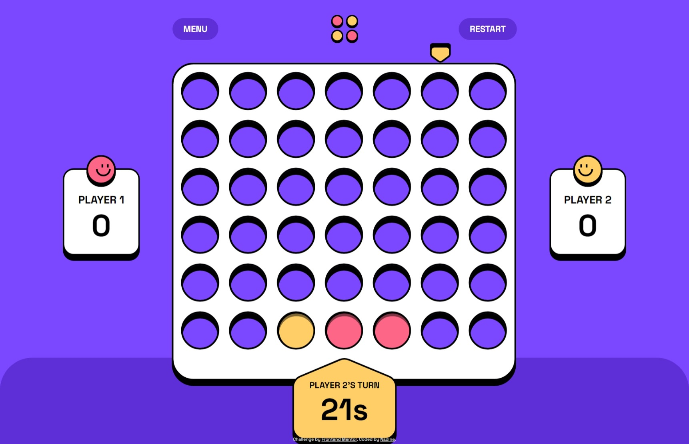

# Frontend Mentor - Connect Four game solution

This is a solution to the [Connect Four game challenge on Frontend Mentor](https://www.frontendmentor.io/challenges/connect-four-game-6G8QVH923s). Frontend Mentor challenges help you improve your coding skills by building realistic projects.

## Overview

### The challenge

Users should be able to:

- View the game rules
- Play a game of Connect Four against another human player (alternating turns on the same computer)
- View the optimal layout for the interface depending on their device's screen size
- See hover and focus states for all interactive elements on the page
- **Bonus**: See the discs animate into their position when a move is made
- **Bonus**: Play against the computer

### Screenshot

### Links

- Solution URL: [https://github.com/nadlgit/fmchallenge-connect-four-game](https://github.com/nadlgit/fmchallenge-connect-four-game)
- Live Site URL: [https://nadlgit.github.io/fmchallenge-connect-four-game](https://nadlgit.github.io/fmchallenge-connect-four-game)

## Built with

- [React](https://reactjs.org/)
- [Typescript](https://www.typescriptlang.org/)
- [Vite](https://vitejs.dev/)
- [CSS modules](https://github.com/css-modules/css-modules)
- Tested with [Vitest](https://vitest.dev/) and [jest-extended](https://jest-extended.jestcommunity.dev/)

Notice that computer is totally stupid. To implement something more interesting it seems that [minimax algoritm with alpha-beta pruning](https://en.wikipedia.org/wiki/Alpha%E2%80%93beta_pruning) could be a good pick.
